안녕하세요? 우아한형제들에서 정산시스템을 개발하고 있는 이호진입니다.  
지금부터 정산시스템 API 문서를 wiki 에서 Spring Rest Docs 로 전환한 이야기를 해보려고 합니다.

# 1. 전환하는 이유
현재 정산시스템은 API 문서를 wiki 로 공유하고 있었습니다.

며칠 전 API 에 필드를 추가하고 API 문서를 확인해보니 변경된 코드와 달랐습니다.  
있어야 할 필드가 없었고 없어야 할 필드가 있었으며 같은 값을 주는 필드가 각기 다른이름의 필드로 제공되었습니다.

예)
```
{
 "capital" : "Seoul",
 "sudo" : "Seoul"
}
```

팀내 다른 서비스들은 Spring Rest Docs 를 통해서 현재 운영중인 API 와 API 문서를 동일하게 관리하고 있습니다.  
API 문서를 자동화를 하겠다고 결심한 후 어떻게 도입을 할지 고민 해봤습니다. 

# 2. Spring Rest Docs 채택 이유
자바 문서 자동화에는 주로 Swagger 와 Spring Rest Docs 가 사용됩니다.

|   |Spring Rest Docs|Swagger|
|---|---|---|
|장점|제품코드에 영향 없다.|API 를 테스트 해 볼수 있는 화면을 제공한다.|
|   |테스트가 성공해야 문서작성된다.|적용하기 쉽다.                       |
|단점|적용하기 어렵다.|제품코드에 어노테이션 추가해야한다.          |
|    |  |제품코드와 동기화가 안될수 있다.|

API 문서의 목적은 개발하는 스펙을 정의하는것이라 생각합니다.  
Swagger는 API 동작을 테스트하는 용도에 더 특화되어있습니다.  
반면에 Spring Rest Docs 은 깔끔 명료한 문서를 만들수 있습니다.  
그래서 문서 제공용으로는 Spring Rest Docs 이 좀 더 낫다고 생각합니다.

# 3. Spring Rest Docs 작성 방법
정산시스템은  
* SpringBoot 2.1.1
* Gradle 4.8.1
* jUnit4
* MockMvc
* AsciiDoc

을 사용하여 Rest Docs 를 작성하고 있습니다.

## 3-1. junit4 vs Spock

정산시스템 테스트는 Spock 과 junit 으로 되어있습니다.  


|   |junit|Spock|
|---|---|---|
|장점|라이브러리를 추가하지 않아도 된다.|BDD 스타일로 직관적이다.|
|   |컴파일 시점에 오류를 잡기 쉽다.|동적 테스트가 쉽다.|
|단점|동적 테스트 작성이 불편하다.|라이브러리를 추가해야한다.|
|   |    |컴파일 시점에 오류를 찾기가 힘들다.|
 
Spock 은 별도의 라이브러리를 추가해야하고 문서작성용으로는 조금 과하다고 느껴서  
Spring Rest Docs 작성용으로 junit 을 채택하였습니다.

> Spock에 대해서 더 알고 싶으신 분은 [블로그](http://woowabros.github.io/study/2018/03/01/spock-test.html)를 참고해주세요.

## 3-2. MockMvc(@WebMvcTest) VS Rest Assured(@SpringBootTest)

보통 문서를 작성할때 서비스 계층은 Mocking을 하여 작성합니다. 

Rest Assured 는 BDD 스타일로 직관적이지만 별도의 구성없이는 @SpringBootTest 로 수행해야합니다.  
그러면 전체 컨테스트를 로드하여 빈을 주입하기에 속도가 많이 느립니다.  

반면에 MockMvc 는 @WebMvcTest 로 수행이 가능합니다.  
그래서 Controller Layer 만 테스트 하기에 속도가 빠릅니다.

만약 통합테스트를 한다면 Rest Assured가 좋은 선택일것 같지만   
Spring Rest Docs 로 문서를 작성하는데에는 MockMvc 가 더 나은 선택이라 생각합니다.


> 별도의 구성으로 Rest Assured 에서 MockMvc를 사용하실 분은 [링크](https://github.com/rest-assured/rest-assured/wiki/GettingStarted#spring-mock-mvc)를 참고해주세요.
 
## 3-3. AsciiDoc VS Markdown
Markdown 이 작성하기 편하지만 Include 가 되지 않은 단점이 있습니다.  

Slate 를 사용하면 가능하다고 하지만 결과물이 우리가 생각한 doc 파일과는 다르며 별도 설정을 해야하는 번거로움이 있습니다.

그래서 AsciiDoc으로 채택하였습니다.

> 자세한 내용은 [블로그](https://jojoldu.tistory.com/289)를 참고해주세요.

## 3-4. 작성방법 정리
기술 선택에 있어서 junit, MockMvc(@WebMvcTest), asciiDoc 을 선택한 이유는 위에서 설명했던 내용과 더불어 최소한의 라이브러리로 구현할수 있기 때문입니다.  
별도의 Dependency 를 추가하면 가능한 내용입니다만 문서 자동화를 위해서 더 많은 라이브러리를 추가하는게 맞을까? 라는 고민을 해봤습니다.

# 4. 예제
### ./build.gradle
```groovy

buildscript {
    ext {
        springBootVersion = '2.1.1.RELEASE'
    }
    repositories {
        mavenCentral()
    }
    dependencies {
        classpath("org.springframework.boot:spring-boot-gradle-plugin:${springBootVersion}")
    }
}

plugins {
    id "org.asciidoctor.convert" version "1.5.9.2" // (1) 
}

apply plugin: 'java'
apply plugin: 'eclipse'
apply plugin: 'org.springframework.boot'
apply plugin: 'io.spring.dependency-management'

group = 'com.example'
version = '0.0.1-SNAPSHOT'
sourceCompatibility = 1.8

asciidoctor {
    dependsOn test // (2)
}

bootJar {
    dependsOn asciidoctor // (3)
    from ("${asciidoctor.outputDir}/html5") { // (4)
        into 'static/docs'
    }
}

repositories {
    mavenCentral()
}

dependencies {
    implementation('org.springframework.boot:spring-boot-starter-web')
    implementation('org.springframework.boot:spring-boot-starter-data-jpa')
    implementation('org.projectlombok:lombok')
    runtimeOnly('com.h2database:h2')
    testImplementation('org.springframework.boot:spring-boot-starter-test')
    testImplementation('org.springframework.restdocs:spring-restdocs-mockmvc') // (5)
}

```
(1) AsciiDoc 파일을 컨버팅하고 Build 폴더에 복사하기 위한 플러그인입니다.  
(3) gradle build 시 test -> asciidoctor 순으로 수행됩니다.  
(3) gradle build 시 asciidoctor -> bootJar 순으로 수행됩니다.  
(4) gradle build 시 ```./build/asciidoc/html5/``` 에 html 파일이 생깁니다.  
이것을 jar 안에 /static/docs/ 폴더에 복사가 됩니다.  
(5) mockmvc 를 restdocs 에 사용할수 있게 하는 라이브러리입니다.  

> Rest Assured 를 사용하자고 하시면 ```testCompile('org.springframework.restdocs:spring-restdocs-restassured')``` 를 대신 사용하시면 됩니다.

### test/**/ApiDocumentUtils.java
```java
public interface ApiDocumentUtils {

    static OperationRequestPreprocessor getDocumentRequest() {
        return preprocessRequest(
                        modifyUris() // (1)
                                .scheme("https")
                                .host("docs.api.com")
                                .removePort(),
                        prettyPrint()); // (2)
    }

    static OperationResponsePreprocessor getDocumentResponse() {
        return preprocessResponse(prettyPrint()); // (3)
    }
}
```
(1) 문서상 uri 를 기본값인 http://localhost:8080 에서 https://docs.api.com 으로 변경하기 위해 사용합니다.  
(2) 문서의 request 을 예쁘게 출력하기 위해 사용합니다.  
(3) 문서의 response 를 예쁘게 출력하기 위해 사용합니다.

### test/**/PersonDocumentationTests 
```java
@RunWith(SpringRunner.class)
@WebMvcTest(PersonController.class)
@AutoConfigureRestDocs(uriScheme = "https", uriHost = "docs.api.com") // (1)
public class PersonDocumentationTests {

    @Autowired
    private MockMvc mockMvc;

    @Autowired
    private ObjectMapper objectMapper;

    @MockBean // (2)
    private PersonService personService;

    @Test
    public void update() throws Exception {

        //given
        PersonDto.Response response = PersonDto.Response.builder()
                .id(1L)
                .firstName("호석")
                .lastName("이")
                .birthDate(LocalDate.of(1985, 2, 1))
                .gender(Gender.MALE)
                .hobby("신나게놀기")
                .build();

        given(personService.update(eq(1L), any(PersonDto.Update.class)))
                .willReturn(response); // (3)

        //when
        PersonDto.Update update = new PersonDto.Update();
        update.setFirstName("호석");
        update.setLastName("이");
        update.setBirthDate(LocalDate.of(1985, 2, 1));

        ResultActions result = this.mockMvc.perform(
                put("/persons/{id}", 1L)
                        .content(objectMapper.writeValueAsString(update))
                        .contentType(MediaType.APPLICATION_JSON)
                        .accept(MediaType.APPLICATION_JSON)
        );

        //then
        result.andExpect(status().isOk())
                .andDo(document("persons-update", // (4)
                        getDocumentRequest(),
                        getDocumentResponse(),
                        pathParameters(
                                parameterWithName("id").description("아이디")
                        ),
                        requestFields(
                                fieldWithPath("firstName").type(JsonFieldType.STRING).description("이름"),
                                fieldWithPath("lastName").type(JsonFieldType.STRING).description("성"),
                                fieldWithPath("birthDate").type(JsonFieldType.STRING).description("생년월일"),
                                fieldWithPath("hobby").type(JsonFieldType.STRING).description("취미")
                        ),
                        responseFields(
                                fieldWithPath("code").type(JsonFieldType.STRING).description("결과코드"),
                                fieldWithPath("message").type(JsonFieldType.STRING).description("결과메시지"),
                                fieldWithPath("data.person.id").type(JsonFieldType.NUMBER).description("아이디"),
                                fieldWithPath("data.person.firstName").type(JsonFieldType.STRING).description("이름"),
                                fieldWithPath("data.person.lastName").type(JsonFieldType.STRING).description("성"),
                                fieldWithPath("data.person.age").type(JsonFieldType.NUMBER).description("나이"),
                                fieldWithPath("data.person.birthDate").type(JsonFieldType.STRING).description("생년월일"),
                                fieldWithPath("data.person.gender").type(JsonFieldType.STRING).description("성별"),
                                fieldWithPath("data.person.hobby").type(JsonFieldType.STRING).description("취미")
                        )
                ));
    }
}
```
(1)은 getDocumentRequest에 선언된 uri 와 동일 기능을 제공합니다. 아래의 우선순위로 적용됩니다.
1. @AutoConfigureRestDocs 에 uri 정보가 선언되어있으면 적용 없으면 2 단계로 
2. getDocumentRequest 에 uri 정보가 설정되어있으면 적용 없으면 3 단계로
3. 기본설정값 적용 http://localhost:8080

외부 API의 문서를 작성하거나 PHP 같은 다른 언어로 만들어진 API를 추가 제공해야할시 유용할것 같습니다.

(2) mocking을 하기위해 @MockBean 을 선언하였습니다.  
(3) mocking을 하여 예상응답값을 받습니다.  
(4) test 수행시 ```./build/generated-snippets/``` 하위에 지정한 문자열의 폴더 하위에 문서가 작성됩니다.  

>그림 4-1. 폴더구조

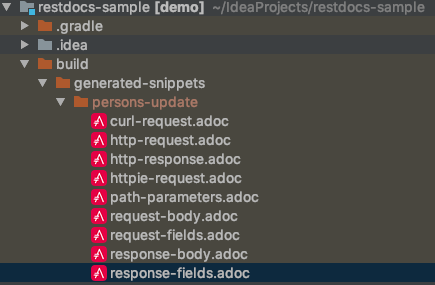

>그림 4-2. http-request

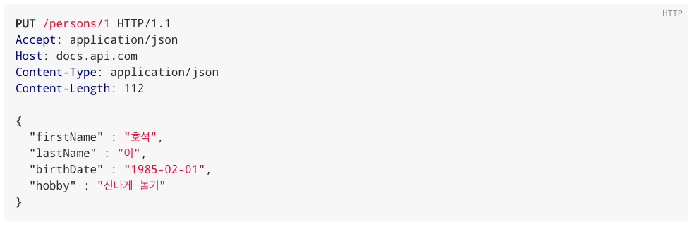

>그림 4-3. http-response

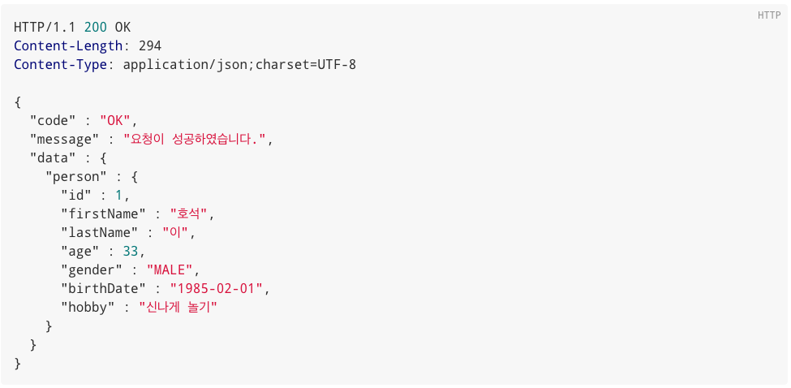

>그림 4-4. path-parameter

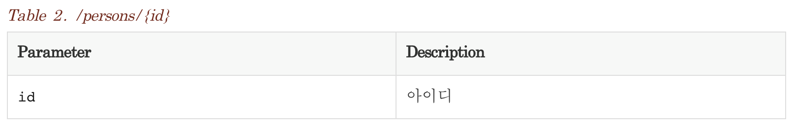

>그림 4-5. request-fields

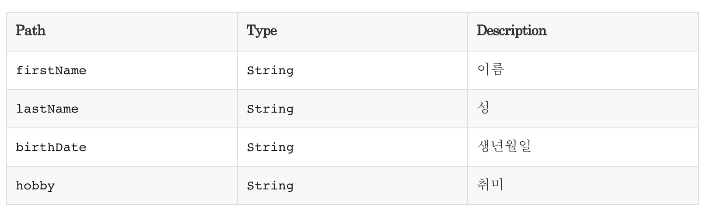

>그림 4-6. response-fields

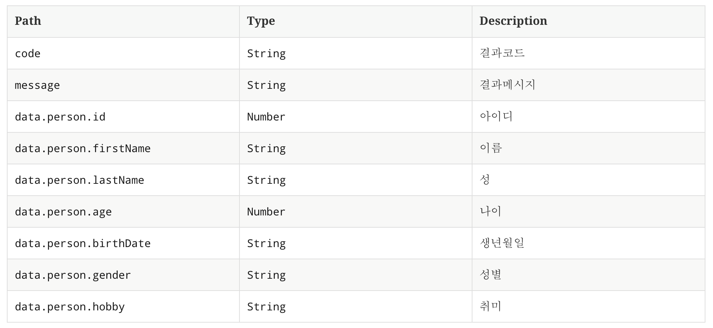

# 5. 기능추가
문서를 만들다보니 문서에 조금씩 추가됐으면 하는 기능들이 생겼습니다. 
1. 필수값 여부
: 입력 필드들이 필수값인지 아닌지 여부 표시
2. 입력 포맷
: 예를 들어 날짜 같은 경우 yyyy-MM-dd 로 할지 yyyyMMdd 로 할지 표시
3. 입력해야하는 코드 표기
: 성별 같은경우 MALE, FEMALE 을 받는데 이것을 표시
4. 공통 포맷
: code, message, data 포맷은 공통이기에 한번만 표시

제가 어떻게 해결했는지 설명드리겠습니다.

## 5-1. 필수값 여부
### test/**/PersonDocumentationTests 
```java
public class PersonDocumentationTests {
...
    @Test
    public void update() throws Exception {

        //then
        result.andExpect(status().isOk())
                .andDo(document("persons-update",
                        ...
                        requestFields(
                                fieldWithPath("firstName").type(JsonFieldType.STRING).description("이름"),
                                fieldWithPath("lastName").type(JsonFieldType.STRING).description("성"),
                                fieldWithPath("birthDate").type(JsonFieldType.STRING).description("생년월일"),
                                fieldWithPath("hobby").type(JsonFieldType.STRING).description("취미").optional() // (1)
                        )
                        ...
}
```
(1) optional() 을 이용하였습니다. 초반에는 required() 라는 메서드를 만들어서 사용하였습니다.  
하지만 optional() 이 선택이라는 의미로 중복되는 기능이라 판단하여 변경하였습니다.

그리고 또 한가지 작업을 할게 잇습니다.  
기본적으로 제공하는 스니펫에는 없는 필드이기에 스니펫을 customizing 해야합니다.  
스니펫은 mustache 문법을 사용합니다.
  
request-fields 의 스니펫을 customizing 하려면 ```src/test/resources/org/springframework/restdocs/templates``` 경로에 ```request-fields.snippet``` 파일을 추가하면 됩니다.

### test/**/request-fields.snippet
```handlebars
===== Request Fields // (1)
|===
|필드명|타입|필수값|설명

{{#fields}}
|{{#tableCellContent}}`+{{path}}+`{{/tableCellContent}}
|{{#tableCellContent}}`+{{type}}+`{{/tableCellContent}}
|{{#tableCellContent}}{{^optional}}true{{/optional}}{{/tableCellContent}}  //(2)
|{{#tableCellContent}}{{description}}{{/tableCellContent}}

{{/fields}}
|===
```
(1) 해당 화면의 타이틀을 붙여줬습니다.  
(2) mustache 문법 중 ```{{^param}}{{/param}}``` 은 param이 비어있거나 false 일때 작동됩니다.  
그래서 ```{{^optional}}true{{/optional}}``` 을 사용하여 optional 이 false 인 것을 필수로 표현했습니다.

> 5-1. 필수값이 추가된 request-fields

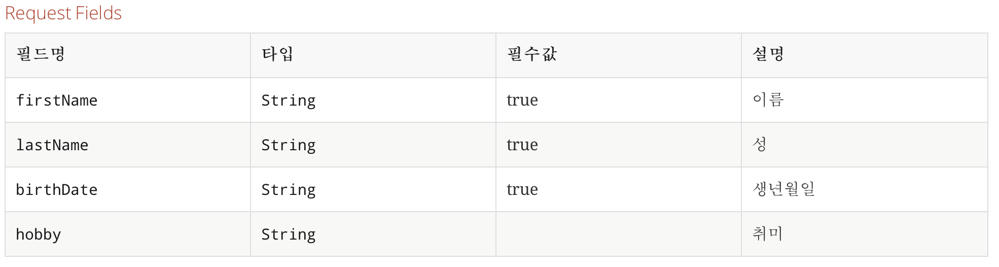

## 5-2. 입력 포맷
### test/**/PersonDocumentationTests 
```java
public class PersonDocumentationTests {
...
    @Test
    public void update() throws Exception {

        //then
        result.andExpect(status().isOk())
                .andDo(document("persons-update",
                        ...
                        requestFields(
                                fieldWithPath("firstName").type(JsonFieldType.STRING).description("이름"),
                                fieldWithPath("lastName").type(JsonFieldType.STRING).description("성"),
                                fieldWithPath("birthDate").type(JsonFieldType.STRING).attributes(getDateFormat()).description("생년월일"), // (1)
                        ...
}
```
(1) attributes 를 이용해서 추가 속성을 넣을수 있습니다.
### test/**/DocumentFormatGenerator 
```java

public interface DocumentFormatGenerator {

    static Attributes.Attribute getDateFormat() { // (2)
        return key("format").value("yyyy-MM-dd");
    }
}
```
(2) attributes에 key와 values를 각각 넣을수 있지만  
반복적으로 사용되는 것들은 static 메서드로 사용하는것을 추천합니다.
### test/**/request-fields.snippet
```handlebars
===== Request Fields
|===
|필드명|타입|필수값|양식|설명

{{#fields}}
|{{#tableCellContent}}`+{{path}}+`{{/tableCellContent}}
|{{#tableCellContent}}`+{{type}}+`{{/tableCellContent}}
|{{#tableCellContent}}{{^optional}}true{{/optional}}{{/tableCellContent}}
|{{#tableCellContent}}{{#format}}{{.}}{{/format}}{{/tableCellContent}} //(3)
|{{#tableCellContent}}{{description}}{{/tableCellContent}}

{{/fields}}
|===
```
(3) mustache 문법 중 ```{{#param}}{{/param}}``` 은 param이 존재하거나 true 일때 작동됩니다.  
그래서 ```{{#format}}{{/format}}``` 을 사용하면 format 을 표현할수 있습니다.  
하지만 이렇게 사용하면 해당 스니펫을 사용하는 requestFields 모든 fields 에 format 이라는 키 속성을 넣어줘야합니다.  
그것을 우회하려면 ```{{#param}}{{.}}{{/param}}``` 로 표기 해주면 됩니다.
  
> 5-2. 양식이 추가된 request-fields

 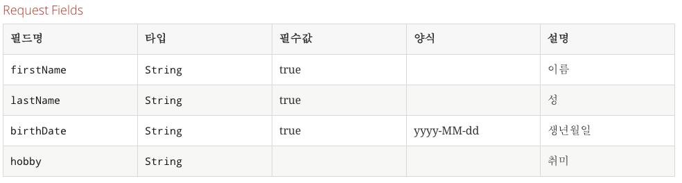

## 5-3. 입력해야하는 코드 표기
### test/**/CommonDocumentationTests 
```java
@RunWith(SpringRunner.class)
@WebMvcTest(EnumViewController.class)
@AutoConfigureRestDocs
public class CommonDocumentationTests {

    @Autowired
    private MockMvc mockMvc;

    @Test
    public void commons() throws Exception {

        this.mockMvc.perform(
                get("/docs")  // (1)
                        .accept(MediaType.APPLICATION_JSON)
        )

                .andExpect(status().isOk())
                .andDo(document("common",
                        customResponseFields("custom-response", beneathPath("data.genders").withSubsectionId("genders"), // (2)
                                attributes(key("title").value("성별")),
                                enumConvertFieldDescriptor(Gender.values())
                        )
                ));
    }

    private FieldDescriptor[] enumConvertFieldDescriptor(EnumType[] enumTypes) {
        return Arrays.stream(enumTypes)
                .map(enumType -> fieldWithPath(enumType.getId()).description(enumType.getText()))
                .toArray(FieldDescriptor[]::new);
    }

    public static CustomResponseFieldsSnippet customResponseFields(String type,
                                                                   PayloadSubsectionExtractor<?> subsectionExtractor,
                                                                   Map<String, Object> attributes, FieldDescriptor... descriptors) {
        return new CustomResponseFieldsSnippet(type, subsectionExtractor, Arrays.asList(descriptors), attributes
                , true);
    }
}
```
(1) /docs 를 endpoint로 가지는 Controller 를 test 패키지에 만듭니다.  
test 패키지에 만들면 테스트 수행때만 동작하기에 실제 운영에서는 호출되지 않습니다.    
(2) response-fields 스니펫을 이미 선언했기에 모든 응답필드는 해당 response-fields 를 사용하게 됩니다.  
그렇게 되면 불필요한 포맷과 필수 여부가 테이블에 나타나서 보기가 않좋습니다.  
그래서 특정 이름의 스니펫을 사용할수 있게 CustomResponseFieldsSnippet 를 만들었습니다.
### test/**/CustomResponseFieldsSnippet
```java
public class CustomResponseFieldsSnippet extends AbstractFieldsSnippet {

    public CustomResponseFieldsSnippet(String type, PayloadSubsectionExtractor<?> subsectionExtractor,
                                    List<FieldDescriptor> descriptors, Map<String, Object> attributes,
                                    boolean ignoreUndocumentedFields) {
        super(type, descriptors, attributes, ignoreUndocumentedFields,
                subsectionExtractor);
    }

    @Override
    protected MediaType getContentType(Operation operation) {
        return operation.getResponse().getHeaders().getContentType();
    }

    @Override
    protected byte[] getContent(Operation operation) throws IOException {
        return operation.getResponse().getContent();
    }
}
```
### test/**/custom-response-fields.snippet
```groovy
{{title}}
|===
|코드|코드명

{{#fields}}
|{{#tableCellContent}}`+{{path}}+`{{/tableCellContent}}
|{{#tableCellContent}}{{description}}{{/tableCellContent}}

{{/fields}}
|===

```
이렇게 하면 코드와 코드명만 나오는 간결한 스니펫이 생성됩니다.

> 5-3. 공통 코드 전용 custom-response-fields (성별)

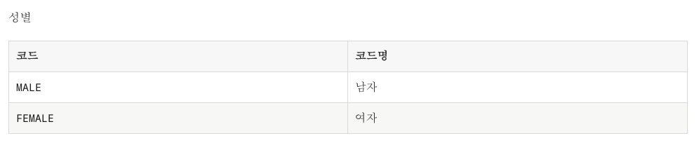

## 5-4. 공통 포맷
### test/**/CommonDocumentationTests 
```java
public class CommonDocumentationTests {
...
    @Test
    public void commons() throws Exception {

        //then
        result.andExpect(status().isOk())
                .andDo(document("common",
                        customResponseFields("custom-response", null, // (1)
                                                        attributes(key("title").value("공통응답")), 
                                                        subsectionWithPath("data").description("데이터"),
                                                        fieldWithPath("code").type(JsonFieldType.STRING).description("결과코드"),
                                                        fieldWithPath("message").type(JsonFieldType.STRING).description("결과메시지")
                                                )
                                                ...
}
```
(1) 결과코드, 결과메시지, 데이터 형식의 공통 response를 출력합니다.
### test/**/PersonDocumentationTests 
```java
public class PersonDocumentationTests {
...
    @Test
    public void update() throws Exception {

        //then
        result.andExpect(status().isOk())
                .andDo(document("persons-update",
                        ...
                        responseFields(
                                beneathPath("data").withSubsectionId("data"), // (2)
                                fieldWithPath("person.id").type(JsonFieldType.NUMBER).description("아이디"),
                        ...
}
```
(2) data의 subsection을 표시합니다. 결과 파일 이름은 response-fields-data 로 됩니다.

> 5-4. 공통 코드 전용 custom-response-fields (공통응답)

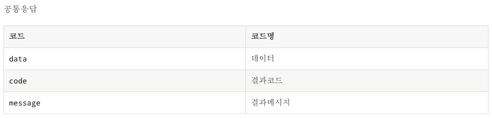

> 5-5. 공통이 제거된 response-fields

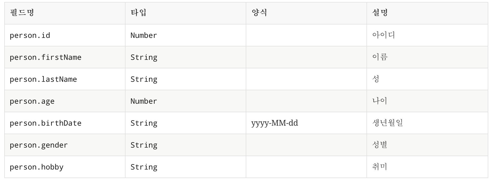

# 6. 마무리

Spring Rest Docs 를 적용하면서 제공하고 있는 몇몇 API 문서가 잘못되었다는것을 알았습니다.  
이제라도 고칠수 있음에 감사하며 조금 더 예쁘게 만들수 있는 방법을 찾아봐야겠습니다.
  
인터넷에 찾아보면 Spring Rest Docs 를 작성하는 다양한 방법이 존재하는데 상황에 맞는 방법을 쓰면 될것 같습니다.


블로그에 사용된 전체 코드는 [Github](https://github.com/hojinDev/restdocs-sample/tree/junit-mockmvc)으로 확인 하실수 있습니다.

